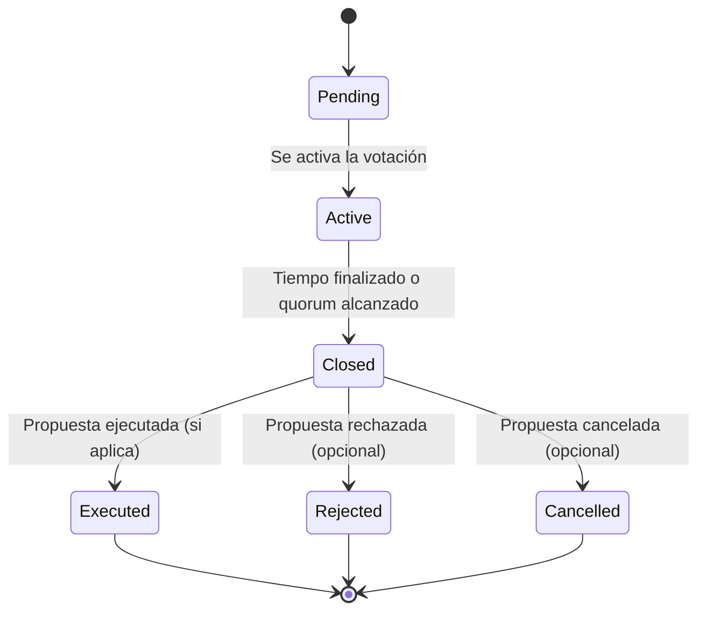

# Welcome to your Lovable project

## Project info

**URL**: https://lovable.dev/projects/8171a3d3-581f-43bd-ae33-39ff87490c69

## How can I edit this code?

There are several ways of editing your application.

**Use Lovable**

Simply visit the [Lovable Project](https://lovable.dev/projects/8171a3d3-581f-43bd-ae33-39ff87490c69) and start prompting.

Changes made via Lovable will be committed automatically to this repo.

**Use your preferred IDE**

If you want to work locally using your own IDE, you can clone this repo and push changes. Pushed changes will also be reflected in Lovable.

The only requirement is having Node.js & npm installed - [install with nvm](https://github.com/nvm-sh/nvm#installing-and-updating)

Follow these steps:

```sh
# Step 1: Clone the repository using the project's Git URL.
git clone <YOUR_GIT_URL>

# Step 2: Navigate to the project directory.
cd <YOUR_PROJECT_NAME>

# Step 3: Install the necessary dependencies.
npm i

# Step 4: Start the development server with auto-reloading and an instant preview.
npm run dev
```

**Edit a file directly in GitHub**

- Navigate to the desired file(s).
- Click the "Edit" button (pencil icon) at the top right of the file view.
- Make your changes and commit the changes.

**Use GitHub Codespaces**

- Navigate to the main page of your repository.
- Click on the "Code" button (green button) near the top right.
- Select the "Codespaces" tab.
- Click on "New codespace" to launch a new Codespace environment.
- Edit files directly within the Codespace and commit and push your changes once you're done.

## What technologies are used for this project?

This project is built with .

- Vite
- TypeScript
- React
- shadcn-ui
- Tailwind CSS

## How can I deploy this project?

Simply open [Lovable](https://lovable.dev/projects/8171a3d3-581f-43bd-ae33-39ff87490c69) and click on Share -> Publish.

## I want to use a custom domain - is that possible?

We don't support custom domains (yet). If you want to deploy your project under your own domain then we recommend using Netlify. Visit our docs for more details: [Custom domains](https://docs.lovable.dev/tips-tricks/custom-domain/)

# Despliegue y Auditoría del Smart Contract de Gobernanza

## Despliegue del Contrato

Este repositorio incluye un smart contract de gobernanza (ver `/contracts/Governance.sol`). Para desplegarlo en una red compatible con EVM (por ejemplo, Ethereum, Polygon, etc.) usando Hardhat:

```sh
# Instala dependencias si no lo has hecho
npm install

# Compila los contratos
npx hardhat compile

# Despliega en una red local (Hardhat Network)
npx hardhat run scripts/deploy.ts --network localhost

# O despliega en testnet (Goerli, Mumbai, etc.)
npx hardhat run scripts/deploy.ts --network <network>
```

Asegúrate de configurar las claves y endpoints en `hardhat.config.ts`.

## Ejecución de Pruebas Unitarias

Las pruebas unitarias están en `test/Governance.test.ts`.

```sh
npx hardhat test
```

Esto validará la creación de propuestas, votación, cierre, ejecución, elegibilidad, doble voto y gestión de roles.

## Estructura de Roles

- **Creador:** Puede crear propuestas.
- **Votante:** Puede votar en propuestas (requiere elegibilidad, por ejemplo, poseer un token/NFT o estar en whitelist).
- **Auditor:** Acceso de solo lectura para auditoría pública.
- **Administrador/Gobernanza:** Puede asignar roles y actualizar parámetros clave mediante consenso.

## Interacción Básica

### CLI/Consola

Puedes interactuar con el contrato usando scripts Hardhat o consola:

```sh
# Ejemplo: crear una propuesta
npx hardhat run scripts/createProposal.ts --network <network>

# Ejemplo: votar
npx hardhat run scripts/vote.ts --network <network>
```

Adapta los scripts según tus necesidades.

### Front-end

El front-end React (ver `/src/`) puede integrarse con el contrato usando ethers.js o wagmi. Ejemplo básico:

```ts
import { ethers } from 'ethers';
// ...
const contract = new ethers.Contract(address, abi, signer);
await contract.createProposal('Descripción', duracion, quorum, true);
```

## Ejemplos de Scripts de Interacción (Hardhat + ethers.js)

### Despliegue (`scripts/deploy.ts`)
```ts
import { ethers } from "hardhat";

async function main() {
  const Governance = await ethers.getContractFactory("Governance");
  const governance = await Governance.deploy();
  await governance.deployed();
  console.log("Governance deployed to:", governance.address);
}

main().catch((error) => {
  console.error(error);
  process.exitCode = 1;
});
```

### Crear Propuesta (`scripts/createProposal.ts`)
```ts
import { ethers } from "hardhat";

async function main() {
  const [signer] = await ethers.getSigners();
  const governance = await ethers.getContractAt("Governance", "<GOVERNANCE_ADDRESS>", signer);
  const tx = await governance.createProposal("Descripción de prueba", 3600, 1, true);
  await tx.wait();
  console.log("Propuesta creada");
}

main();
```

### Votar (`scripts/vote.ts`)
```ts
import { ethers } from "hardhat";

async function main() {
  const [signer] = await ethers.getSigners();
  const governance = await ethers.getContractAt("Governance", "<GOVERNANCE_ADDRESS>", signer);
  const tx = await governance.vote(1, true); // true = a favor, false = en contra
  await tx.wait();
  console.log("Voto emitido");
}

main();
```

### Cerrar Propuesta (`scripts/closeProposal.ts`)
```ts
import { ethers } from "hardhat";

async function main() {
  const [signer] = await ethers.getSigners();
  const governance = await ethers.getContractAt("Governance", "<GOVERNANCE_ADDRESS>", signer);
  const tx = await governance.closeProposal(1);
  await tx.wait();
  console.log("Propuesta cerrada");
}

main();
```

### Ejecutar Propuesta (`scripts/executeProposal.ts`)
```ts
import { ethers } from "hardhat";

async function main() {
  const [signer] = await ethers.getSigners();
  const governance = await ethers.getContractAt("Governance", "<GOVERNANCE_ADDRESS>", signer);
  const tx = await governance.executeProposal(1);
  await tx.wait();
  console.log("Propuesta ejecutada");
}

main();
```

## Troubleshooting e Integración Front-end

- **Error de ABI o dirección:** Verifica que la dirección y el ABI del contrato coincidan con el despliegue actual.
- **Problemas de red:** Asegúrate de que el provider apunte a la red correcta (localhost, testnet, mainnet).
- **Permisos/Roles:** Si recibes errores de permisos, revisa que la cuenta tenga el rol adecuado en el contrato.
- **Votación o creación de propuestas fallida:** Verifica que la propuesta esté activa y que el usuario no haya votado previamente.
- **Front-end:** Usa ethers.js o wagmi para conectar el contrato. Ejemplo:

```ts
import { ethers } from 'ethers';
const provider = new ethers.providers.Web3Provider(window.ethereum);
const signer = provider.getSigner();
const contract = new ethers.Contract(address, abi, signer);
// Interactúa con las funciones del contrato
```

- **Auditoría manual:**
  - Consulta eventos en el explorador de bloques (Etherscan, Polygonscan, etc.).
  - Usa funciones públicas del contrato para listar propuestas y votos.
  - Revisa los resultados de las pruebas unitarias (`npx hardhat test`).

Para dudas adicionales, consulta la documentación de ethers.js, Hardhat y revisa los issues del repositorio.

¿Dudas o sugerencias? ¡Abre un issue o contribuye directamente!

# Guía Paso a Paso: Despliegue, Testeo y Auditoría del Smart Contract de Gobernanza

## 1. Preparación del Entorno

1. **Clona el repositorio y entra en la carpeta:**
   ```sh
   git clone <YOUR_GIT_URL>
   cd <YOUR_PROJECT_NAME>
   ```
2. **Instala dependencias:**
   ```sh
   npm install
   ```
3. **Configura variables de entorno:**
   - Crea un archivo `.env` en la raíz con:
     ```env
     PRIVATE_KEY=<tu_clave_privada>
     ALCHEMY_API_KEY=<tu_api_key_alchemy>
     INFURA_API_KEY=<tu_api_key_infura>
     # Otras variables según tu configuración de red
     ```
   - **Nunca compartas tu clave privada.**

4. **Configura redes en `hardhat.config.ts`:**
   Ejemplo para Goerli y Polygon Mumbai:
   ```ts
   networks: {
     goerli: {
       url: `https://eth-goerli.alchemyapi.io/v2/${process.env.ALCHEMY_API_KEY}`,
       accounts: [process.env.PRIVATE_KEY!],
     },
     mumbai: {
       url: `https://polygon-mumbai.infura.io/v3/${process.env.INFURA_API_KEY}`,
       accounts: [process.env.PRIVATE_KEY!],
     },
   }
   ```

## Ejemplo de archivo `.env` seguro

Crea un archivo `.env` en la raíz del proyecto con el siguiente contenido (no compartas nunca tus claves reales):

```
# Clave privada de la cuenta de despliegue (usa una wallet dedicada para test)
PRIVATE_KEY=0xabc123...tu_clave_privada...

# API Keys para proveedores de nodos
ALCHEMY_API_KEY=tu_api_key_alchemy
INFURA_API_KEY=tu_api_key_infura
```

**Recomendaciones de seguridad:**
- Usa wallets dedicadas para test y despliegue, nunca tu wallet principal.
- Si necesitas regenerar una clave, hazlo desde tu wallet (por ejemplo, MetaMask: Configuración > Seguridad > Exportar clave privada > Generar nueva cuenta).
- No subas nunca el archivo `.env` a repositorios públicos. El archivo `.gitignore` debe incluir `.env` por defecto.
- Puedes usar wallets compatibles con EVM como MetaMask, Rabby, Frame, Ledger, Trezor, etc.
- Si una clave se filtra, transfiere los fondos y revoca permisos inmediatamente.

## 2. Despliegue del Contrato

1. **Compila los contratos:**
   ```sh
   npx hardhat compile
   ```
2. **Despliega en red de test (ejemplo Goerli):**
   ```sh
   npx hardhat run scripts/deploy.ts --network goerli
   ```
   - Guarda la dirección del contrato desplegado.

## 3. Testeo del Contrato

1. **Ejecuta las pruebas unitarias:**
   ```sh
   npx hardhat test
   ```
2. **Pruebas manuales:**
   - Usa los scripts de ejemplo (`scripts/createProposal.ts`, `vote.ts`, etc.)
   - Cambia `<GOVERNANCE_ADDRESS>` por la dirección real del contrato.
   - Ejecuta:
     ```sh
     npx hardhat run scripts/createProposal.ts --network goerli
     npx hardhat run scripts/vote.ts --network goerli
     # ...otros scripts
     ```

## 4. Troubleshooting de Permisos y Errores Comunes

- **Error de permisos:**
  - Asegúrate de que la cuenta tenga el rol adecuado (ver función `assignRole`).
  - Verifica que la clave privada corresponde a la cuenta esperada.
- **Error de red:**
  - Revisa la URL y API key de la red en `hardhat.config.ts`.
- **Error de doble voto o elegibilidad:**
  - Verifica que la cuenta no haya votado antes y que tenga el rol de votante.
- **Problemas de gas:**
  - Asegúrate de tener suficiente ETH/MATIC en la cuenta para pagar gas en testnet.

## 5. Comprobación de Resultados en Exploradores de Bloques

- Busca la dirección del contrato en [Etherscan Goerli](https://goerli.etherscan.io/) o [Polygonscan Mumbai](https://mumbai.polygonscan.com/).
- Revisa los eventos emitidos (ProposalCreated, Voted, etc.) en la pestaña "Events".
- Usa la pestaña "Read/Write Contract" para interactuar manualmente.

---

# Sección Avanzada: Auditoría de Seguridad y Buenas Prácticas DAO

## Auditoría de Seguridad

- **Revisión de código:**
  - Analiza funciones críticas (votación, cierre, ejecución, asignación de roles).
  - Busca posibles reentradas, overflows, o errores de lógica en permisos.
- **Herramientas recomendadas:**
  - [Slither](https://github.com/crytic/slither) para análisis estático.
  - [MythX](https://mythx.io/) para análisis de vulnerabilidades.
  - [OpenZeppelin Defender](https://defender.openzeppelin.com/) para monitoreo y gestión de contratos.
- **Pruebas de fuzzing:**
  - Usa herramientas como Echidna para pruebas automáticas de escenarios límite.
- **Auditoría comunitaria:**
  - Publica el contrato y anima a la comunidad a revisar y reportar issues.

## Buenas Prácticas para Gobernanza DAO

- **Transparencia:**
  - Todos los votos y propuestas deben ser públicos y auditables.
- **Flexibilidad:**
  - Permite actualizar parámetros clave solo mediante consenso y votación.
- **Prevención de ataques Sybil:**
  - Usa mecanismos de verificación de identidad, staking o soulbound tokens.
- **Gestión de emergencias:**
  - Considera incluir pausas de emergencia (circuit breaker) y mecanismos de recuperación.
- **Documentación:**
  - Mantén el código y la documentación actualizados y claros para la comunidad.
- **Pruebas y simulaciones:**
  - Simula escenarios de gobernanza antes de desplegar en mainnet.

---

## Automatización CI/CD (GitHub Actions)

Puedes automatizar pruebas y despliegues usando GitHub Actions. Ejemplo de workflow en `.github/workflows/ci.yml`:

```yaml
name: CI

on:
  push:
    branches: [main]
  pull_request:
    branches: [main]

jobs:
  test:
    runs-on: ubuntu-latest
    steps:
      - uses: actions/checkout@v3
      - name: Setup Node.js
        uses: actions/setup-node@v3
        with:
          node-version: '20'
      - name: Install dependencies
        run: npm install
      - name: Compile contracts
        run: npx hardhat compile
      - name: Run tests
        run: npx hardhat test
        env:
          PRIVATE_KEY: ${{ secrets.PRIVATE_KEY }}
          ALCHEMY_API_KEY: ${{ secrets.ALHEMY_API_KEY }}
          INFURA_API_KEY: ${{ secrets.INFURA_API_KEY }}
  # Puedes añadir un job de despliegue bajo demanda o a mainnet/testnet
```

**Notas:**
- Añade tus claves y API keys como `secrets` en la configuración del repositorio de GitHub (Settings > Secrets and variables > Actions).
- Nunca escribas claves directamente en el workflow.
- Puedes extender el workflow para desplegar automáticamente en testnet tras pasar los tests.

---

## Despliegue Automático en Testnet/Mainnet (CI/CD)

Puedes automatizar el despliegue en testnet o mainnet usando GitHub Actions y Hardhat, manteniendo control manual sobre los despliegues a entornos críticos.

### Ejemplo de Workflow para Despliegue Manual (GitHub Actions)

Crea `.github/workflows/deploy.yml`:

```yaml
name: Deploy Smart Contract

on:
  workflow_dispatch:
    inputs:
      network:
        description: 'Red de despliegue (goerli, mumbai, mainnet, etc.)'
        required: true
        default: 'goerli'

jobs:
  deploy:
    runs-on: ubuntu-latest
    environment:
      name: ${{ github.event.inputs.network }}
      url: ${{ steps.deploy.outputs.contract_url }}
    steps:
      - uses: actions/checkout@v3
      - name: Setup Node.js
        uses: actions/setup-node@v3
        with:
          node-version: '20'
      - name: Install dependencies
        run: npm install
      - name: Compile contracts
        run: npx hardhat compile
      - name: Deploy contract
        id: deploy
        run: |
          npx hardhat run scripts/deploy.ts --network ${{ github.event.inputs.network }}
        env:
          PRIVATE_KEY: ${{ secrets.PRIVATE_KEY }}
          ALCHEMY_API_KEY: ${{ secrets.ALHEMY_API_KEY }}
          INFURA_API_KEY: ${{ secrets.INFURA_API_KEY }}
      - name: Tag contract version
        run: |
          git config user.name "github-actions"
          git config user.email "github-actions@github.com"
          git tag deploy-${{ github.event.inputs.network }}-$(date +'%Y%m%d%H%M%S')
          git push --tags
      - name: Create GitHub Release
        uses: softprops/action-gh-release@v2
        with:
          tag_name: deploy-${{ github.event.inputs.network }}-$(date +'%Y%m%d%H%M%S')
          name: "Deploy ${{ github.event.inputs.network }} $(date +'%Y-%m-%d %H:%M:%S')"
          body: |
            Despliegue automático del contrato en ${{ github.event.inputs.network }}.
            Commit: ${{ github.sha }}
```

### ¿Cómo funciona?
- El workflow se ejecuta manualmente desde la pestaña "Actions" de GitHub (no en cada push).
- El usuario elige la red de despliegue (testnet/mainnet) al lanzar el workflow.
- El contrato se despliega usando las claves almacenadas en `secrets`.
- Se crea un tag y un release en GitHub con la versión y commit del despliegue, manteniendo trazabilidad.

### Buenas prácticas:
- **Nunca almacenes claves privadas en el código. Usa siempre `secrets` de GitHub.**
- Limita el acceso a la ejecución del workflow a miembros de confianza.
- Documenta la dirección del contrato y el hash del commit en cada release.
- Para mainnet, revisa y aprueba los cambios antes de lanzar el workflow.

---

## Auditoría post-despliegue

### Verificación del contrato en Etherscan/Polygonscan

1. **Verifica el contrato para transparencia:**
   - Permite a cualquier usuario inspeccionar el código fuente, ABI y bytecode en el explorador de bloques.

2. **Verificación manual con Hardhat:**
   - Tras desplegar, ejecuta:
     ```sh
     npx hardhat verify --network <network> <CONTRACT_ADDRESS> <constructor_args>
     ```
   - Ejemplo:
     ```sh
     npx hardhat verify --network goerli 0x1234... "arg1" "arg2"
     ```
   - Si usas constructor sin argumentos, omite los parámetros.

3. **Verificación automática en el workflow CI/CD:**
   - Añade un paso al workflow de GitHub Actions tras el despliegue:
     ```yaml
     - name: Verify contract on Etherscan
       run: |
         npx hardhat verify --network ${{ github.event.inputs.network }} <CONTRACT_ADDRESS>
       env:
         ETHERSCAN_API_KEY: ${{ secrets.ETHERSCAN_API_KEY }}
     ```
   - Añade tu API key de Etherscan/Polygonscan a los secrets del repositorio.

4. **Publica el ABI y dirección:**
   - Incluye el ABI y la dirección del contrato en el README, releases y documentación.
   - Sube el ABI a IPFS o un repositorio público si es posible.

### Checklist de auditoría pública tras cada release

- [ ] El contrato está verificado en Etherscan/Polygonscan y el código fuente es público.
- [ ] El ABI y la dirección están documentados y accesibles.
- [ ] Los eventos clave (ProposalCreated, Voted, etc.) son visibles y auditables en el explorador.
- [ ] Se ha publicado un changelog detallando cambios y migraciones.
- [ ] Se invita a la comunidad a revisar el código y reportar issues.
- [ ] Se han ejecutado pruebas unitarias y de integración en CI/CD.
- [ ] Se ha revisado el historial de tags/releases para trazabilidad.
- [ ] Se han documentado los parámetros de gobernanza y roles activos.

**Buenas prácticas:**
- Usa la verificación automática en el workflow para evitar olvidos.
- Publica enlaces directos al contrato verificado y releases en los canales de la comunidad.
- Mantén la documentación y el changelog siempre actualizados.

---

## Publicación del ABI y Release Notes

### ¿Cómo extraer y publicar el ABI tras el despliegue?

1. **Extraer el ABI automáticamente:**
   - El ABI se genera al compilar el contrato y se encuentra en `artifacts/contracts/Governance.sol/Governance.json`.
   - Puedes copiar el ABI manualmente o exportarlo con un script:
     ```sh
     jq .abi artifacts/contracts/Governance.sol/Governance.json > abi.json
     ```
   - Publica el archivo `abi.json` en el repositorio, IPFS o en la sección de assets del release.

2. **Publicar el ABI y dirección:**
   - Incluye en el README, documentación y cada release:
     - Dirección del contrato desplegado
     - ABI (o enlace a `abi.json`)
     - Enlace directo a la verificación en Etherscan/Polygonscan

### Plantilla de Release Notes para cada versión

Recomendación: usa esta plantilla en cada release/tag de GitHub para máxima trazabilidad y transparencia.

---

#### Release Notes vX.Y.Z

- **Fecha:** YYYY-MM-DD
- **Commit:** `<commit-hash>`
- **Dirección del contrato:** `0x...`
- **Red:** Goerli / Mumbai / Mainnet / ...
- **Enlace a Etherscan/Polygonscan:** [Ver contrato](https://goerli.etherscan.io/address/0x...)
- **ABI:** [Descargar abi.json](./abi.json)
- **Hash de bytecode:** `<bytecode-hash>`

##### Cambios principales
- Breve descripción de las nuevas funcionalidades, fixes o migraciones.

##### Checklist de auditoría
- [x] Contrato verificado en Etherscan/Polygonscan
- [x] ABI publicado y accesible
- [x] Pruebas unitarias y de integración superadas
- [x] Eventos clave auditables
- [x] Documentación y changelog actualizados

##### Notas
- Instrucciones para migración, si aplica
- Invitación a la comunidad para revisión y feedback

---

Con esto, cada release será completamente auditable y transparente para cualquier usuario o auditor externo.

Con estos pasos, garantizas máxima transparencia y confianza para la comunidad tras cada despliegue y actualización del contrato.

Con este enfoque, puedes auditar fácilmente qué versión del contrato está desplegada en cada red y mantener un historial claro de despliegues y releases.

¿Listo para desplegar y gobernar? ¡Sigue estos pasos y consulta la comunidad para mejores resultados y seguridad!

## Resumen de la Interfaz del Contrato

| Función                      | Descripción                                                      | Roles permitidos         |
|------------------------------|------------------------------------------------------------------|--------------------------|
| createProposal(desc, dur, q, open) | Crea una nueva propuesta                                      | Creador                  |
| vote(proposalId, support)    | Vota a favor/en contra de una propuesta                          | Votante                  |
| closeProposal(proposalId)    | Cierra la votación de una propuesta                              | Admin/Gobernanza         |
| executeProposal(proposalId)  | Ejecuta la propuesta si fue aprobada                             | Admin/Gobernanza         |
| assignRole(address, role)    | Asigna un rol a un usuario                                       | Admin/Gobernanza         |
| getProposal(proposalId)      | Consulta detalles y estado de una propuesta                      | Público                  |
| getAllProposals()            | Lista todas las propuestas                                       | Público                  |

## Ciclo de Vida de una Propuesta

| Estado        | Acción que lo inicia                | Descripción breve                                      |
|---------------|-------------------------------------|--------------------------------------------------------|
| Pending       | Creación de propuesta               | Propuesta registrada, aún no activa                    |
| Active        | Inicio de votación (por tiempo)     | Se puede votar, la propuesta está abierta              |
| Closed        | Fin de tiempo/quorum alcanzado      | Votación cerrada, esperando ejecución                  |
| Executed      | Ejecución de la propuesta           | Propuesta implementada (si fue aprobada)               |

> Consulta la documentación inline del contrato para detalles de parámetros y eventos.

## Diagrama de Estados de la Propuesta (Mermaid)



> Puedes ampliar los estados según la lógica de tu contrato (Rejected, ExecutedWithError, Cancelled, etc.).
> Se recomienda documentar inline con NatSpec en el propio contrato Solidity para máxima transparencia y mantenibilidad.
